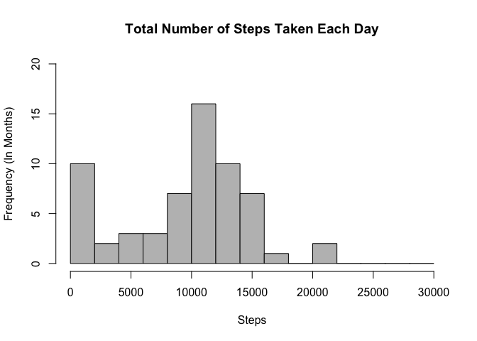
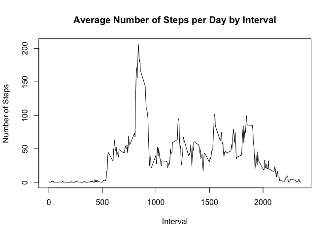
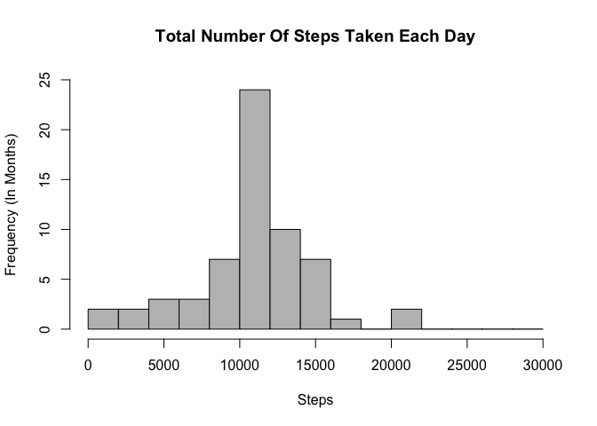
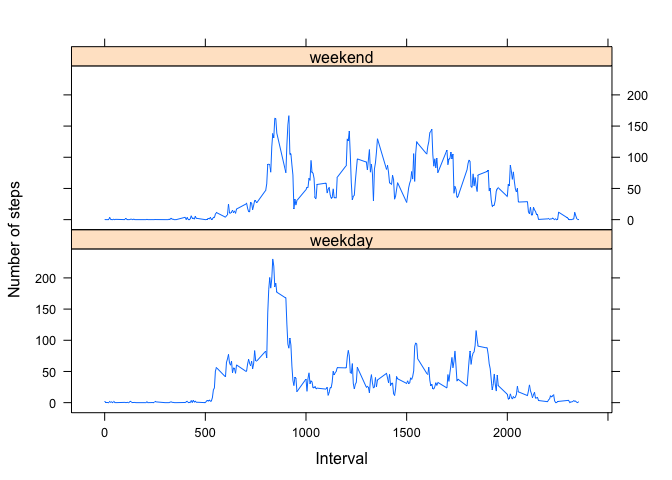

## Loading and preprocessing the data
Show any code that is needed to

1. Load the data (i.e. 𝚛𝚎𝚊𝚍.𝚌𝚜𝚟())
2. Process/transform the data (if necessary) into a format suitable for your analysis.


```r
    # load the file
    activities <- read.csv("activity.csv")
    
    # activities is a data frame
    summary(activities)
```

```
##      steps                date          interval     
##  Min.   :  0.00   2012-10-01:  288   Min.   :   0.0  
##  1st Qu.:  0.00   2012-10-02:  288   1st Qu.: 588.8  
##  Median :  0.00   2012-10-03:  288   Median :1177.5  
##  Mean   : 37.38   2012-10-04:  288   Mean   :1177.5  
##  3rd Qu.: 12.00   2012-10-05:  288   3rd Qu.:1766.2  
##  Max.   :806.00   2012-10-06:  288   Max.   :2355.0  
##  NA's   :2304     (Other)   :15840
```

## What is mean total number of steps taken per day?
For this part of the assignment, you can ignore the missing values in the dataset.

1. Calculate the total number of steps taken per day

2. If you do not understand the difference between a histogram and a barplot, research the difference between them. Make a histogram of the total number of steps taken each day

3. Calculate and report the mean and median of the total number of steps taken per day


```r
    # stepsPerDay <- tapply(activities$steps, activities$date, FUN=sum, na.rm=TRUE)
    # will have the same result
    stepsPerDay <- with(activities, tapply(steps, date, FUN=sum, na.rm=TRUE))
    
    # stepsPerDay is an array with names
    # stepsPerDay_frame is a data frame 
    stepsPerDay_frame <- data.frame(Date=names(stepsPerDay), Steps=stepsPerDay)
    
    # make a histogram plot
    hist(stepsPerDay_frame$Steps, 
       breaks = seq(from=0, to=30000, by=2000), 
       col = "grey", 
       ylim = c(0,20), 
       xlab = "Steps", 
       ylab = "Frequency (In Months)", 
       main = "Total Number of Steps Taken Each Day"
       )
```

<!-- -->

```r
    # calculate the mean of the number of steps taken per day
    mean(stepsPerDay_frame$Steps)
```

```
## [1] 9354.23
```

```r
    # calculate the median of the number of steps taken per day
    median(stepsPerDay_frame$Steps)
```

```
## [1] 10395
```


## What is the average daily activity pattern?
1. Make a time series plot (i.e. 𝚝𝚢𝚙𝚎 = "𝚕") of the 5-minute interval (x-axis) and the average number of steps taken, averaged across all days (y-axis)

2. Which 5-minute interval, on average across all the days in the dataset, contains the maximum number of steps?


```r
    # calculate the average steps within each interval
    # stepsPerInterval is an array
    stepsPerInteval <- with(activities, tapply(steps, interval, FUN=mean, na.rm=TRUE))
    stepsPerInteval_frame <- data.frame(Interval=names(stepsPerInteval), 
                                  Steps=stepsPerInteval, stringsAsFactors = FALSE)
  
    # type = 'l' means a line chart
    plot(stepsPerInteval_frame$Interval, 
        stepsPerInteval_frame$Steps, 
        type = 'l', 
        xlab = "Interval", 
        ylab = "Number of Steps", 
        main = "Average Number of Steps per Day by Interval"
    )
```

<!-- -->

```r
    # calculate the interval that has the max steps
    stepsPerInteval_frame[which.max(stepsPerInteval_frame$Steps),]
```

```
##     Interval    Steps
## 835      835 206.1698
```

## Imputing missing values
Note that there are a number of days/intervals where there are missing values (coded as 𝙽𝙰). The presence of missing days may introduce bias into some calculations or summaries of the data.

1. Calculate and report the total number of missing values in the dataset (i.e. the total number of rows with 𝙽𝙰s)

2. Devise a strategy for filling in all of the missing values in the dataset. The strategy does not need to be sophisticated. For example, you could use the mean/median for that day, or the mean for that 5-minute interval, etc.

3. Create a new dataset that is equal to the original dataset but with the missing data filled in.

4. Make a histogram of the total number of steps taken each day and Calculate and report the mean and median total number of steps taken per day. Do these values differ from the estimates from the first part of the assignment? What is the impact of imputing missing data on the estimates of the total daily number of steps?


```r
    # calculte all the missing values in the dataset
    missingValues <- is.na(activities)
    # TRUE or FALSE count
    table(missingValues)
```

```
## missingValues
## FALSE  TRUE 
## 50400  2304
```

```r
    result <- function(inputData){
    # is.na returns TRUE/FALSE of the array in each position
    inputData$steps[is.na(inputData$steps)] <- stepsPerInteval_frame$Steps
    return(inputData)
    }
    
    filledData <- result(activities)
    head(filledData)
```

```
##       steps       date interval
## 1 1.7169811 2012-10-01        0
## 2 0.3396226 2012-10-01        5
## 3 0.1320755 2012-10-01       10
## 4 0.1509434 2012-10-01       15
## 5 0.0754717 2012-10-01       20
## 6 2.0943396 2012-10-01       25
```

```r
    stepsEachDay <- aggregate(filledData$steps, by=list(filledData$date), FUN=sum)
    names(stepsEachDay) <- c("Date", "Steps")
    hist(stepsEachDay$Steps, 
       breaks=seq(from=0, to=30000, by=2000),
       col = "grey",
       ylim = c(0,25),
       xlab = "Steps",
       ylab = "Frequency (In Months)",
       main = "Total Number Of Steps Taken Each Day"
    )
```

<!-- -->

```r
    mean(stepsEachDay$Steps)
```

```
## [1] 10766.19
```

```r
    median(stepsEachDay$Steps)
```

```
## [1] 10766.19
```
Conclusion: Replacing the missing values with the average value will increase the mean and the median of the steps taken each day.


## Are there differences in activity patterns between weekdays and weekends?
For this part the weekdays() function may be of some help here. Use the dataset with the filled-in missing values for this part.

1. Create a new factor variable in the dataset with two levels -- "weekday" and "weekend" indicating whether a given date is a weekday or weekend day. 

2. Make a panel plot containing a time series plot (i.e. type = "l") of the 5-minute interval (x-axis) and the average number of steps taken, averaged across all weekday days or weekend days (y-axis). The plot should look something like the following, which was created using simulated data:


```r
    # create a factor determined by whether the date is weekday or weekend
    weekFactor <- ifelse(weekdays(as.Date(filledData$date)) %in%  
        c("Monday", "Tuesday", "Wednesday", "Thursday", "Friday"),"weekday", "weekend")
```

```
## Warning in strptime(xx, f <- "%Y-%m-%d", tz = "GMT"): unknown timezone
## 'default/America/New_York'
```

```r
    # combine the newly created factor into fillData
    fillData <- cbind(filledData, weekFactor)
    
    # using lattice plotting system
    library(lattice)
    filleDatadAndMean <- aggregate(steps ~ interval + weekFactor, data=fillData, mean)
    xyplot(steps ~ interval | weekFactor, 
         filleDatadAndMean, 
         layout = c(1,2), 
         xlab="Interval", 
         ylab="Number of steps", 
         type="l"
    )
```

<!-- -->
